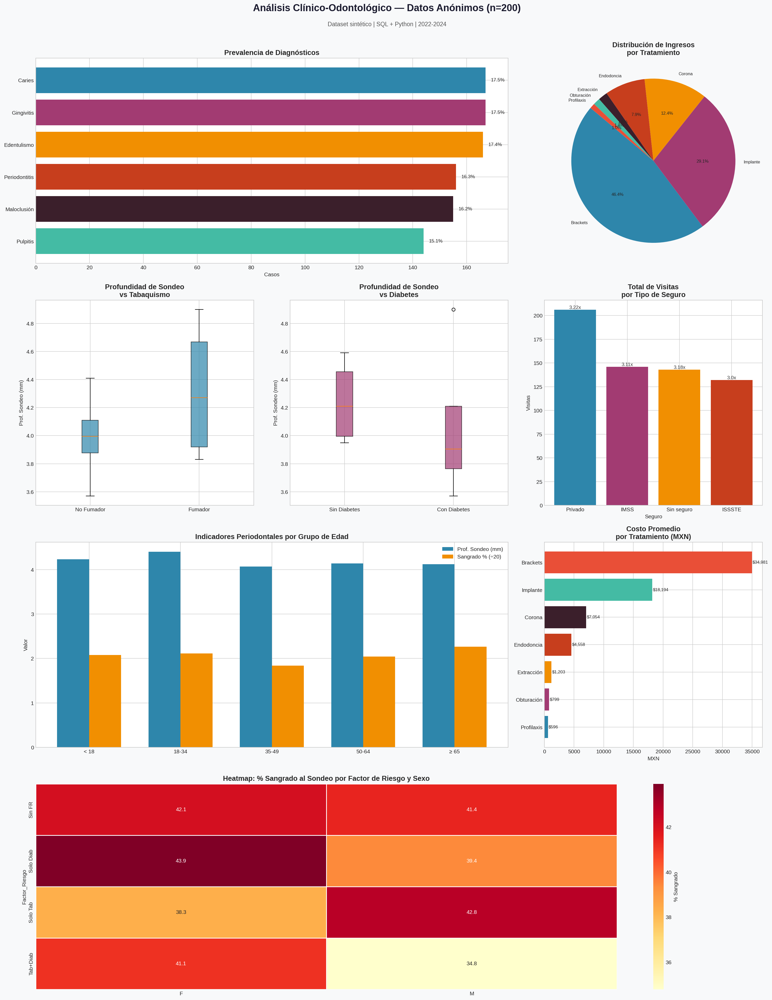

# 🦷 SQL Aplicado a Salud Bucal: Patrones, Riesgo y Dinero en un Solo Análisis


> **¿Qué revelan los datos de un consultorio dental?**  
> Este proyecto demuestra cómo SQL puede transformar registros clínicos en decisiones estratégicas de salud y negocio.

---

## 🎯 Objetivo

Construir un pipeline de análisis clínico-odontológico end-to-end usando SQL como motor principal de consultas, sobre un dataset sintético anónimo de **200 pacientes**, **600+ visitas** y **3 años de registros** (2022–2024).

---

## 🗄️ Arquitectura de la Base de Datos

Base de datos relacional diseñada en **tercera forma normal (3NF)** con 5 tablas interconectadas:
```sql
pacientes(paciente_id, edad, sexo, tabaquismo, diabetes, seguro)
    │
    ├── visitas(visita_id, paciente_id, fecha, motivo, dr_id)
    │       ├── diagnosticos(diag_id, visita_id, codigo_cie, descripcion, severidad)
    │       └── tratamientos(trat_id, visita_id, tipo, costo_mxn, pieza)
    │
    └── examenes_perio(examen_id, paciente_id, fecha, prof_sondeo, sangrado_pct, calculo)
```

---

## 🔍 Consultas SQL Destacadas

### Window Functions — Prevalencia relativa de diagnósticos
```sql
SELECT descripcion,
       COUNT(*) AS Total,
       ROUND(100.0 * COUNT(*) / SUM(COUNT(*)) OVER (), 1) AS Porcentaje
FROM diagnosticos
GROUP BY descripcion
ORDER BY Total DESC;
```

### Multi-JOIN + Agregación — Riesgo periodontal por factores clínicos
```sql
SELECT p.sexo, p.tabaquismo, p.diabetes,
       ROUND(AVG(e.prof_sondeo), 2)   AS Prof_Sondeo_Prom,
       ROUND(AVG(e.sangrado_pct), 1)  AS Sangrado_Pct_Prom,
       COUNT(DISTINCT p.paciente_id)  AS N
FROM pacientes p
JOIN examenes_perio e ON p.paciente_id = e.paciente_id
GROUP BY p.sexo, p.tabaquismo, p.diabetes
ORDER BY Prof_Sondeo_Prom DESC;
```

### CASE WHEN — Segmentación por grupo de edad
```sql
SELECT
    CASE
        WHEN edad < 18 THEN '< 18'
        WHEN edad < 35 THEN '18-34'
        WHEN edad < 50 THEN '35-49'
        WHEN edad < 65 THEN '50-64'
        ELSE '≥ 65'
    END AS Grupo_Edad,
    ROUND(AVG(e.prof_sondeo), 2) AS Prof_Sondeo_Prom
FROM pacientes p
JOIN examenes_perio e ON p.paciente_id = e.paciente_id
GROUP BY Grupo_Edad
ORDER BY MIN(edad);
```

---

## 📊 Hallazgos Clave

| # | Hallazgo | Impacto |
|---|----------|---------|
| 1 | Caries y gingivitis representan el **35% de los diagnósticos** | Prioridad en prevención primaria |
| 2 | Pacientes fumadoras con diabetes: **profundidad de sondeo 4.9mm** | Protocolo de riesgo diferenciado |
| 3 | Implantes y brackets generan **+80% de los ingresos** | Estrategia comercial enfocada |
| 4 | Pacientes sin seguro: **menor frecuencia de visitas** | Barrera de acceso documentada |
| 5 | Grupo ≥65 años: **mayor sangrado al sondeo (45.3%)** | Programa de monitoreo adulto mayor |

---

## 📈 Dashboard



---

## 🛠️ Stack Tecnológico

| Herramienta | Uso |
|---|---|
| `SQLite` | Motor de base de datos relacional |
| `Python 3.11` | Lenguaje principal |
| `Pandas` | Manipulación y análisis de datos |
| `Matplotlib` | Visualizaciones estáticas |
| `Seaborn` | Heatmaps y gráficas estadísticas |

---

## 📁 Estructura del Repositorio
```
analisis-odontologico-sql/
├── dental_project.py          # Pipeline completo: datos → SQL → visualización
├── analisis_odontologico.html # Reporte interactivo con tablas y gráficas
├── analisis_odontologico.png  # Dashboard visual de hallazgos
└── README.md
```

---

## ⚠️ Nota sobre los Datos

Todos los datos son **100% sintéticos**, generados con `random` y `numpy.random` (seed=42).  
No contienen información real de pacientes. Creados exclusivamente con fines académicos y de demostración.

---

## 👤 Autor

Hecho con 🦷 y muchas consultas SQL  
⭐ Si te fue útil, dale una estrella al repo
```
